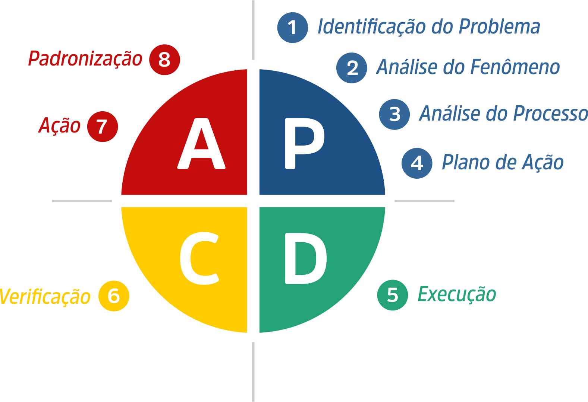
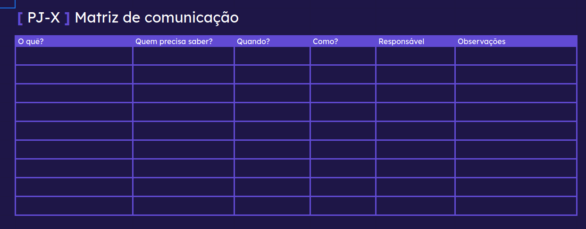
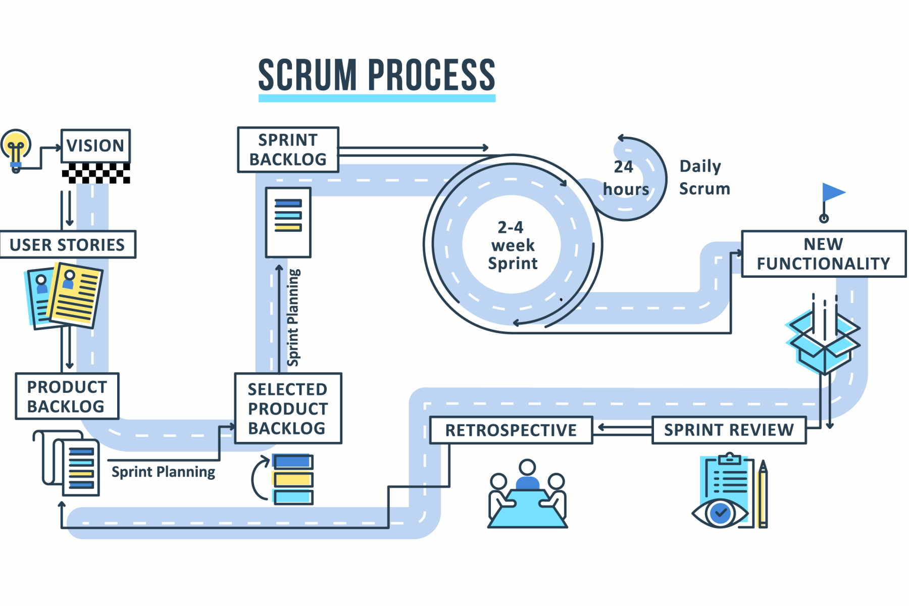

# P.O. Trail

> ⚠️ **Aviso Importante**  
> Este repositório tem finalidade **exclusivamente educacional e de uso pessoal**.  
> Alguns arquivos aqui reunidos (como livros e artigos em PDF) possuem **direitos autorais** e estão disponíveis apenas para **consulta**.  
> É proibida a venda, redistribuição ou modificação destes materiais.

## Sumário

- [P.O. Trail](#po-trail)
  - [Sumário](#sumário)
  - [Importante ressaltar](#importante-ressaltar)
  - [O que é um projeto?](#o-que-é-um-projeto)
  - [Fases de um projeto](#fases-de-um-projeto)
  - [Termo de Abertura do Projeto - TAP](#termo-de-abertura-do-projeto---tap)
  - [Planejamento](#planejamento)
  - [Execução](#execução)
    - [Monitoramento e controle](#monitoramento-e-controle)
  - [Comunicação e Liderança](#comunicação-e-liderança)
    - [Comunicação com o time](#comunicação-com-o-time)
    - [Comunicação com outras partes interessadas](#comunicação-com-outras-partes-interessadas)
    - [Matriz de Comunicação](#matriz-de-comunicação)
      - [Tabela da Matriz de Comunicação](#tabela-da-matriz-de-comunicação)
    - [Reuniões](#reuniões)
      - [Observações para uma boa reunião](#observações-para-uma-boa-reunião)
  - [Fechamento de um projeto](#fechamento-de-um-projeto)
  - [Scrum](#scrum)
    - [Product Owner](#product-owner)
    - [Scrum Master](#scrum-master)
    - [Scrum Team](#scrum-team)
    - [Product Backlog ou Backlog](#product-backlog-ou-backlog)
    - [Sprint](#sprint)
    - [Sprint Planning](#sprint-planning)
    - [Sprint Backlog](#sprint-backlog)
    - [Daily Scrum](#daily-scrum)
    - [Sprint Review](#sprint-review)
    - [Retrospectiva](#retrospectiva)
  - [Scrum Process](#scrum-process)
  - [Mais informações](#mais-informações)
  - [Minha primeira TAP](#minha-primeira-tap)

## Importante ressaltar

- Material produzido por mim durante o processo de estudos e práticas na presente graduação em ADS e conhecimentos advindos da atuação em projetos junto a uma Liga Acadêmica;
- Este repositório aceita colaboração e está em constante expansão com novas informações e contribuições;
- Materiais de apoio, em PDF, para consulta disponíveis: [Books](./books/) e [Articles](./articles/);

## O que é um projeto?

Um projeto é um esforço temporário empreendido para criar um produto, serviço ou resultado único. Ele tem um início, um meio e um fim bem definidos, bem como objetivos específicos a serem alcançados. **PMBOK:** Guia do Conjunto de Conhecimentos em Gerenciamento de Projetos

## Fases de um projeto

- Introdução
- Planejamento
- Execução e acompanhamento
- Fechamento

## Termo de Abertura do Projeto - TAP

- O que é?

    O Termo de Abertura do Projeto (TAP) é um documento que formaliza a existência de um projeto e autoriza o seu início. Ele contém informações essenciais sobre o projeto, como objetivos, escopo, stakeholders e recursos necessários.

- Importância

    O TAP é importante porque estabelece uma base clara para o projeto, garantindo que todos os envolvidos tenham uma compreensão comum dos objetivos e expectativas. Ele também serve como um ponto de referência ao longo do ciclo de vida do projeto.

- Objetivo do projeto(deve seguir a mentalidade `Smart`)

    **Método SMART** (Specific, Measurable, Achievable, Relevant, Time-bound): Ajuda a definir metas claras e alcançáveis, facilitando o acompanhamento do progresso.

    1. Específico(S) -> O quê?
    2. Mensurável(M) -> Quanto? Recursos?
    3. Atingível(A) -> Como?
    4. Relevante(R) -> Por quê?/ Realista?
    5. Temporal(T) -> Quando?

- Justificativa
  
    A justificativa do projeto explica por que o projeto é necessário e quais benefícios ele trará. Ela deve destacar a importância do projeto para a organização e os stakeholders envolvidos.

- Descrição preliminar

    A descrição preliminar do projeto fornece uma visão geral do que será realizado, incluindo os principais entregáveis e marcos. Ela deve ser sucinta, mas informativa o suficiente para que todos os envolvidos compreendam o escopo do projeto.

- Datas importantes (Início e Encerramento)

    As datas importantes do projeto incluem o início e o término previstos, bem como quaisquer marcos significativos ao longo do caminho. Essas datas ajudam a estabelecer um cronograma claro para o projeto.

## Planejamento

- O que é?

    Olhar para a situação atual e traçar um plano para alcançar os objetivos do projeto. Isso envolve a definição de atividades, recursos necessários, prazos e responsabilidades, os quais são definidos no TAP. O planejamento eficaz é fundamental para o sucesso do projeto, pois ajuda a identificar riscos e oportunidades, bem como a estabelecer um cronograma realista.

- Como?(`5W2H`)

    **Método 5W2H**: Ferramenta de gestão que ajuda a planejar e organizar tarefas, respondendo às perguntas: What (O quê?), Why (Por quê?), Where (Onde?), When (Quando?), Who (Quem?), How (Como?) e How much (Quanto?).

  1. What(O quê?) -> Indicado no TAP
  2. Why(Por quê?) -> Justificativa do projeto
  3. Where(Onde?) -> Localização do projeto
  4. When(Quando?) -> Cronograma do projeto
  5. Who(Quem?) -> Equipe do projeto
  6. How(Como?) -> Metodologia do projeto
  7. How much(Quanto?) -> Orçamento do projeto

- "Dividir para conquistar" - Pensando em Passos

    1. Receber o TAP

       - Organizar as informações do TAP em um documento formalizador;
       - Verificar informações presentes;
    2. Levantar informações (pesquisas)
    3. Responder "COMO?";

        - Definir a abordagem e as etapas para alcançar os objetivos do projeto;
        - Identificar as ferramentas e técnicas a serem utilizadas;
        - Estabelecer um cronograma preliminar para as atividades do projeto;
        - Definir os recursos necessários para o projeto;
        - Definir os stakeholders envolvidos no projeto;
        - Identificar os riscos e oportunidades;
        - Construir um cronograma de entregas;

## Execução

- O que é?

    A execução é a fase em que o planejamento do projeto é colocado em prática. Isso envolve a coordenação de pessoas e recursos, bem como a comunicação com os stakeholders. Durante a execução, as atividades do projeto são realizadas de acordo com o cronograma estabelecido, e o progresso é monitorado para garantir que os objetivos sejam alcançados.

- Como?

    1. Mobilizar a equipe do projeto e os recursos necessários.
    2. Comunicar-se regularmente com os stakeholders para mantê-los informados sobre o progresso.
    3. Monitorar o andamento das atividades e fazer ajustes conforme necessário.
    4. Gerenciar riscos e resolver problemas à medida que surgem.
    5. Garantir a qualidade das entregas do projeto.

- Liderança Servidora

    A liderança servidora é um estilo de liderança que coloca as necessidades da equipe em primeiro lugar. Os líderes servidores buscam capacitar e apoiar sua equipe, promovendo um ambiente de colaboração e confiança. Durante a execução do projeto, a liderança servidora é fundamental para garantir que todos os membros da equipe se sintam valorizados e motivados a contribuir para o sucesso do projeto.

    1. Clareza nas solicitações;
    2. Poder sobre e poder com as pessoas;
    3. Facilite o trabalho dos gerenciados;
    4. Paciência, gentileza, humildade, respeito, altruísmo, perdão, honestidade, compromisso;
    5. Saber ouvir/receber feedbacks;
    6. Saiba o limiar entre cobrar e ser flexível;

### Monitoramento e controle

O monitoramento e controle são atividades essenciais para garantir que o projeto permaneça no caminho certo e atinja seus objetivos. Isso envolve a coleta de dados sobre o progresso do projeto, a comparação com o plano original e a realização de ajustes conforme necessário. O monitoramento e controle eficazes ajudam a identificar problemas antecipadamente e a tomar medidas corretivas antes que se tornem críticos.

1. Estabelecer indicadores de desempenho (KPIs) para medir o progresso.
2. Realizar reuniões de acompanhamento regulares com a equipe.
3. Revisar o cronograma e o orçamento do projeto periodicamente.
4. Documentar lições aprendidas e melhores práticas.
5. Comunicar-se com os stakeholders sobre o status do projeto.

O que é KPIs?

Os KPIs (Key Performance Indicators) são métricas utilizadas para avaliar o desempenho de um projeto em relação aos seus objetivos. Eles ajudam a monitorar o progresso, identificar áreas de melhoria e tomar decisões informadas.

- Como garantir uma boa execução da Estrutura Analítica do Projeto (EAP)?

    1. Definir claramente as entregas e resultados esperados.
    2. Estabelecer um cronograma detalhado com prazos realistas.
    3. Alocar recursos adequados para cada tarefa.
    4. Monitorar o progresso regularmente e ajustar conforme necessário.
    5. Promover a comunicação aberta e a colaboração entre os membros da equipe.
    6. Reuniões semanais com definições de prioridade e ciclo PDCA (Plan-Do-Check-Act) para resolver os impasses;

O que é **PDCA**?

O PDCA (Plan-Do-Check-Act) é uma metodologia de gestão que visa a melhoria contínua dos processos. Ela é dividida em quatro etapas:

1. Plan (Planejar): Definir objetivos e metas, identificar problemas e oportunidades de melhoria, e elaborar um plano de ação.
2. Do (Executar): Implementar o plano de ação e realizar as atividades conforme o cronograma.
3. Check (Verificar): Monitorar e avaliar os resultados obtidos, comparando-os com as metas estabelecidas.
4. Act (Agir): Tomar ações corretivas e preventivas com base na análise dos resultados, ajustando o plano conforme necessário.

O ciclo PDCA é iterativo, ou seja, após a etapa "Act", o processo recomeça na etapa "Plan", promovendo a melhoria contínua.

- Comunicação eficiente evita custos operacionais e financeiros no projeto

    1. Método KISS (Keep It Simple, Stupid): Prioriza a simplicidade na comunicação e na execução das tarefas, evitando complicações desnecessárias.
    2. Tenha um canal acessível para todos os membros da equipe;
    3. Utilize ferramentas visuais, como quadros e diagramas, para facilitar a compreensão das informações.

- Softwares recomendados

    1. Trello: Para gerenciamento de tarefas e colaboração em equipe.
    2. Slack: Para comunicação em tempo real e troca de informações.
    3. Google Drive: Para armazenamento e compartilhamento de documentos.
    4. Asana: Para planejamento e acompanhamento de projetos.
    5. Miro: Para brainstorming e criação de mapas mentais.

## Comunicação e Liderança

A comunicação eficaz é fundamental para o sucesso de qualquer projeto. Ela garante que todos os membros da equipe estejam alinhados e cientes de suas responsabilidades. Além disso, uma boa comunicação ajuda a construir relacionamentos de confiança e a resolver conflitos de forma construtiva.

1. Estabeleça canais de comunicação claros e acessíveis.
2. Promova a escuta ativa e o feedback construtivo.
3. Utilize reuniões regulares para manter todos informados e engajados.
4. Adapte seu estilo de comunicação às necessidades da equipe e do projeto.

### Comunicação com o time

A comunicação com a equipe deve ser clara, objetiva e frequente. Algumas práticas recomendadas incluem:

1. Realizar reuniões diárias ou semanais para alinhamento.
2. Utilizar ferramentas de comunicação instantânea para dúvidas rápidas.
3. Incentivar a participação de todos nas discussões.
4. Documentar decisões e encaminhamentos para referência futura.

### Comunicação com outras partes interessadas

A comunicação com outras partes interessadas, como clientes e patrocinadores, também é crucial. Algumas práticas recomendadas incluem:

1. Manter um canal de comunicação aberto e transparente.
2. Fornecer atualizações regulares sobre o progresso do projeto.
3. Estar disponível para esclarecer dúvidas e receber feedback.
4. Adaptar a comunicação ao nível de conhecimento e interesse de cada parte interessada.

### Matriz de Comunicação

A Matriz de Comunicação é uma ferramenta que ajuda a definir e organizar as informações que devem ser compartilhadas com cada parte interessada. Ela pode incluir:

1. Identificação das partes interessadas.
2. Tipo de informação a ser compartilhada.
3. Frequência da comunicação.
4. Canal de comunicação a ser utilizado.

#### Tabela da Matriz de Comunicação

### Reuniões

As reuniões são uma parte essencial da comunicação em projetos. Elas permitem que os membros da equipe se alinhem, discutam problemas e tomem decisões em conjunto. Algumas práticas recomendadas para reuniões eficazes incluem:

1. Definir uma pauta clara e compartilhá-la com antecedência.
2. Estabelecer um horário fixo e respeitar o tempo de todos.
3. Designar um facilitador para conduzir a reunião e garantir que todos tenham a oportunidade de participar.
4. Documentar as decisões e ações acordadas durante a reunião.

#### Observações para uma boa reunião

1. Ela REALMENTE é necessária?
2. Ela tem um planejamento(pauta)?
    1. Quem estará presente? Quem irá liderar?
    2. Onde ocorrerá?
    3. O que será discutido? (Priorize)
    4. Qual a duração? (Mapeie bem, começo e fim)
3. Objetivos claros
4. Foco no essencial
   1. Evite divagações. Tire o que não é essencial
   2. Mantenha a discussão centrada nos objetivos da reunião. Garanta a presença do essencial
   3. Evite desvios
5. Responsabilidades (DRI do Steve Jobs) - DRI - Designated Responsible Individual - definir uma pessoa responsável por cada item da pauta ou para cada ideia nova que surja no processo.
6. Follow-up - Definir um responsável por acompanhar as ações e decisões tomadas na reunião.

## Fechamento de um projeto

O fechamento de um projeto é uma etapa crucial que garante que todas as atividades foram concluídas e que os resultados atendem às expectativas. Algumas práticas recomendadas para o fechamento de um projeto incluem:

1. Catalogar e arquivar todas as documentações produzidas no decorrer do projeto.
2. Revisão final dos entregáveis.
3. Documentação das lições aprendidas.
4. Criar um formulário de feedback para a equipe.
5. Avaliação do desempenho da equipe.
6. Celebração das conquistas.

## Scrum

### Product Owner

O Product Owner (PO) e um membro da equipe responsável por liderar o projeto, definir os objetivos, gerenciar o backlog e garantir que o produto seja entregue conforme o planejado.

### Scrum Master

O Scrum Master (SM) e um membro da equipe responsável por garantir a qualidade do processo de desenvolvimento, coordenar as reuniões e garantir que o projeto seja entregue conforme o planejado.

### Scrum Team

São as pessoas envolvidas na construção doprojeto, as que botão a mão na massa de fato.

### Product Backlog ou Backlog

O Product Backlog (PB) é uma lista de tarefas priorizadas para o desenvolvimento do produto. Cada tarefa tem uma descrição, um priorizador e um estimativa de tempo de conclusão.

### Sprint

Uma Sprint é um período de desenvolvimento de um produto, geralmente de duas a quatro semanas de trabalho, onde o PO define os objetivos, o SM coordena as reuniões e as pessoas trabalham em paralelo para entregar o produto conforme o planejado.

Essas Sprints devem ter duração fixa para garantir que o produto seja entregue conforme o planejado.

### Sprint Planning

A Sprint Planning é uma reunião de planejamento da Sprint, aqui é definido o Sprint Backlog (SB).

### Sprint Backlog

O Sprint Backlog (SB) é uma lista de tarefas priorizadas para o desenvolvimento da Sprint. Cada tarefa tem uma descrição, um priorizador e um estimativa de tempo de conclusão de acordo com as capacidades da equipe.

### Daily Scrum

O Daily Scrum é uma reunião diária de no máximo 15 minutos, onde são respondidas as seguintes perguntas:

1. O que fez ontem?
2. O que vai fazer hoje?
3. Qual o impedimento?

### Sprint Review

Validar e adaptar o produto que está sendoconstruído, verificar se o que está sendo feito está de acordo e também ocorre a apresentação do que foi feito no Sprint. É aqui que ocorrem as mudanças e que o Product Backlog é mudado.

### Retrospectiva

Verificar a necessidade de adaptação no processo, validando o que foi negativo e positivo, o que se deve melhorar e o que se deve parar de fazer.

## Scrum Process

1. Visão (Vision)

    Definida pelo Product Owner (PO) é a definição básica do que será oprdutop, seus objetivos e motivos.

2. Histórias de Usuários (User Stories)

    É a explicação das funcionalidades do projeto partindo do ponto de vista do usuário final, ou seja o que o usuário espera conseguir fazer quando usar o produto.

    **Exemplo:**
   1. Tomando a Persona:

      - Nome: Ana.
      - Função: Gerente de marketing.
      - Dados: 35 anos, trabalha em uma startup de tecnologia.
      - Frustrações: Perde muito tempo com relatórios manuais e complexos.
      - Objetivos: Obter relatórios rápidos e automatizados para tomar decisões estratégicas.

   2. Temos a seguinte história de usuário:

        Como Ana, a gerente de marketing, eu quero um relatório de conversão automática por campanha, para que eu possa analisar rapidamente o retorno sobre o investimento (ROI) e tomar decisões sobre o próximo trimestre.

   3. A partir dessa história informal e resumida do que o usuário deseja que o produto faça, os desenvolvedores podem começar a listar o que se é necessário para atingir as espectativas do usuário e com isso fazer uma lista de ações e features que o produto deve ter.

3. Product Backlog

    Lista todas as funcionalidades do projeto e as ordena pro prioridade de execução.

4. Sprint Planning

    Onde é montado o que vai entrar na Sprint e se monta a Sprint Backlog.

5. Sprint Backlog

    Lista reduzida das tarefas a serem executadas na Sprint.

6. Daily Scrum

    Reuniões rápidas diárias para validar o andamento do projeto.

7. Sprint Review

    Ao final de uma Sprint depois de 2 a 4 semanas, ocorre uma reunião para apresentar as funcionalidades do produto que foram desenvolvidas durante a Sprint.

8. Retrospectiva

    Ao final da Sprint também ocorre uma reunião para avaliar o que foi feito e o que pode ser melhorado.

9. **Ao final do Sprint, o ciclo se repete.**

    Feito essas atividades (Sprint Planning, Sprint Backlog, Daily Scrum, Sprint Review, Retrospectiva), o ciclo se repete até que o Product Backlog esteja vazio e não haja mais funcionalidades para serem desenvolvidas e com isso o produto esteja pronto e funcionando conforme o planejado.

## Mais informações

Para mais informações sobre o assunto de `Gerenciamento de Projetos`, recomendo o seguinte vídeo:

1. [Fundamentos do Grenciamento de Projetos](https://youtu.be/XFdV4Z9SNUk?si=dwKMildsQl3IblEe) - Canal: [for_code](https://www.youtube.com/@for_code)
2. [Fundamentos de Metodologias Ágeis](https://youtu.be/339Hpncdoa8?feature=shared) - Canal: [for_code](https://www.youtube.com/@for_code)

## Minha primeira TAP

Esse TAP foi produzido como parte do processo de aprendizagem de Gerenciamento de Projetos promovio pela Liga Acadêmica `for_code` a qual eu sou membro, por esse motivo a versão PDF está estilizada de acordo com o tema da Liga.

1. [Laços da Liga - em PDF](./docs/lacos_da_liga_tap.pdf)
2. [Laços da Liga - em Markdown](./docs/lacos_da_liga_tap.md)
